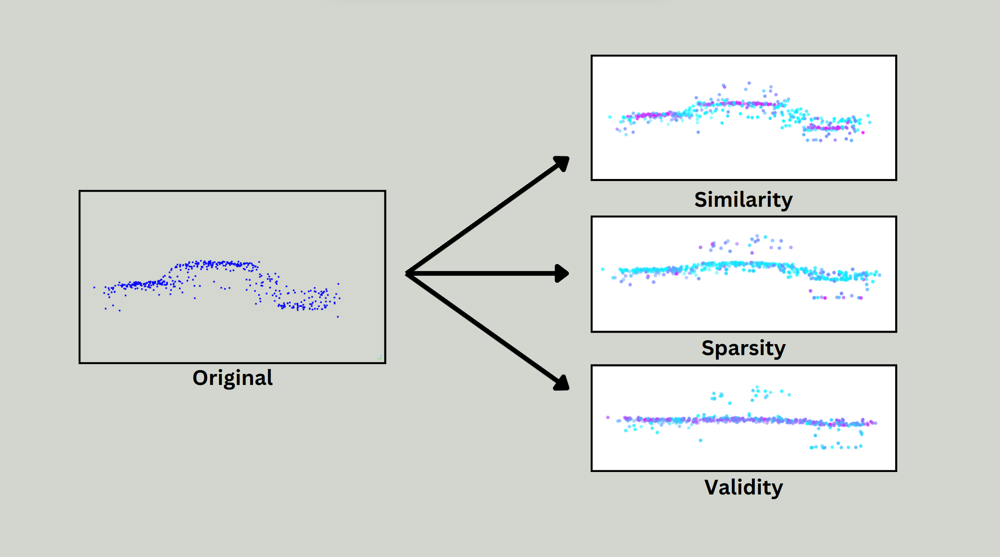

# CXAI3D
This repository is the official implementation of Enhancing Trust in Automated 3D Point Cloud Data Interpretation through Explainable Counterfactuals

<div align="center">
  <div>
    
  </div>
  <p> Figure 1: Generated Counterfactuals from a Vehicle Instance</p>
</div>


# Citation


# Dependencies

If you're running this project for the first time, follow the steps in the project's base directory to create a virtual environment with Python version 3.10. Make sure you have Python 3.10 installed on your system.

### On Windows

  * `cd <path\to\your\project>`
  * Run with Python 3.10: `python -m venv venv`
  * Activate environment: `venv\Scripts\activate.bat`
  * Install requirements: `pip install -r requirements.txt`

### On MacOS
  * `cd /path/to/your/project`
  * Run: `python3.10 -m venv venv`
  * Activate environment: `source venv/bin/activate`
  * Install requirements: `pip install -r requirements.txt`
  
To use Open3D ML Models such as Point Transformer you have to build the Open3D library from scratch by following this link: https://www.open3d.org/docs/release/compilation.html

The datasets are available for download on their official websites:

- [DALES](https://udayton.edu/engineering/research/centers/vision_lab/research/was_data_analysis_and_processing/dale.php)
- [ISPRS Vaihingen](https://www.isprs.org/education/benchmarks/UrbanSemLab/3d-semantic-labeling.aspx)
## Code structure

```
CXAI3D-project
├── perturbation_data                         	# Contains Point Cloud Data (PCD) for perturbation experiments
│   ├── dales
│   └── vaihingen
├── scripts                                   	# Scripts for data preprocessing and visualization
│   ├── solution_unpacking.py                 	# Loads solution .pkl files and applies optimized perturbations
│   ├── result_visualization.py               	# Visualizes perturbed PCD from solution_unpacking.py
│   ├── vaihingen_instance_clustering.py      	# Identifies instances in Vaihingen PCD using clustering
│   └── vaihingen_remapping.py                	# Remaps Vaihingen PCD labels to align with DALES PCD
├── source                                    	# Core source code for perturbation and semantic segmentation
│   ├── perturbations                         	# Logic for generating counterfactuals in PCD via multi-objective optimization
│   │   ├── optimization                      	# Optimization functions and performance improvements
│   │   │   ├── neural_gas.py                 	# Neural Gas implementation for speeding up optimization
│   │   │   └── optimization_utils.py         	# Defines sparsity, similarity, and validity metrics
│   │   ├── pipelines                         	# Predefined pipelines to automate perturbation workflow
│   │   │   └── perturbation_pipeline.py
│   │   ├── problem                           	# Defines the problem formulation for optimization
│   │   │   └── segment_perturbation_problem.py # Multi-objective optimization problem for segment perturbation
│   │   ├── solutions                         	# Stores perturbed PCD results (organized by dataset)
│   │   │   ├── dales
│   │   │   ├── vaihingen
│   │   ├── main.py                           	# Runs perturbation on selected dataset samples
│   │   └── perturbation_utils.py             	# Core logic for perturbation operations
│   ├── semantic_segmentation                 	# Implementation of 3D semantic segmentation models
│   │   ├── datasets                          	# Dataset classes for structured data loading
│   │   │   └── pointcloud_dataset.py         	# Dataset class for DALES and Vaihingen PCD
│   │   ├── models                            	# Implementations of DGCNN, PointNet, and other models
│   │   ├── test.py                           	# Script for evaluating trained semantic segmentation models
│   │   └── train.py                          	# Script for training semantic segmentation models
├── training_data                             	# Preprocessed PCD used for training segmentation models
│   ├── dales
│   ├── vaihingen
├── model_classes.py                          	# Data structures for passing and storing metadata
└── utils.py                                 	# Helper functions (e.g., training, PCD preprocessing)

```

# Example of Use

If you have a trained 3D semantic segmentation model, then you can run the following command:
``` 
python3 source/perturbations/main.py
```

This will generate the results in the ``solutions`` folder. Depending on the algorithm and the dataset, e.g. choosing DALES dataset with NSGAII algorithm, the results will be stored in the following way:
```
├── solutions
│   ├── dales
|   │   ├── nsgaii
|   │   |   ├── segment_pair_27644_73957_algo_ibea_run_1.pkl
|   │   |   ├── segment_pair_27644_73957_algo_ibea_run_1_perturbation_data.pkl
│   ├── vaihingen

```
The .pkl files are then used in the ``solution_unpacking.py`` script. Example:

```
python3 scripts/solution_unpacking.py --algorithm_name=nsga2 --dataset_name=dales --s_index=27644 --sp_index=73957
```
Running the ``result_visualization.py`` script generates the perturbated PCD, the respective pareto-plots and metrics for each objective direction extreme. Example:
```
python3 scripts/result_visualization.py --dataset=dales --algorithm_name=nsga2 --seed=1 --s=27644 --sp=73957
```

# Acknowledgements

This code has been developed with support from the Austrian Science Fund (FWF), Project: P-32554 explainable Artificial Intelligence;


# License Information

This repository is licensed under the **Apache License 2.0** and datasets are licensed under the **Creative Commons Attribution-NonCommercial 3.0 (CC BY-NC 3.0)**.
